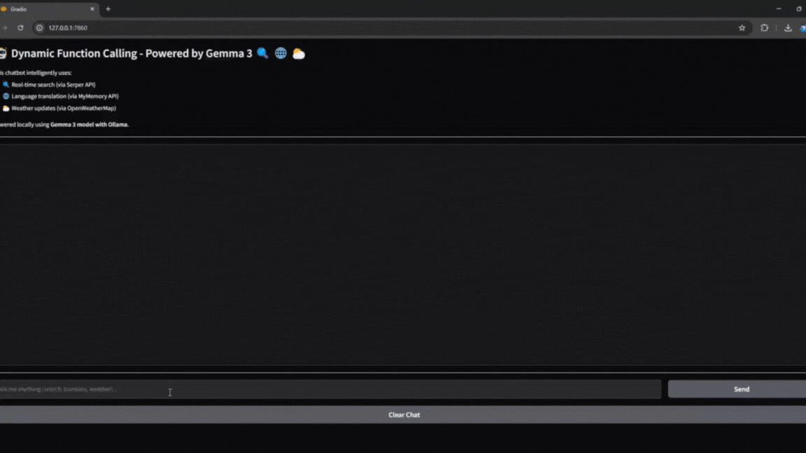

# 🚀 Dynamic Function Calling with Gemma 3 (1B) + Ollama

Demo project showcasing **Gemma 3** running locally with **Ollama** and **dynamic multi-function calling** — real-time search, translation, and weather fetching!


*Demo of Dynamic Function Calling with Gemma 3 (1B) + Ollama*


---

## ✨ Features

- Perform real-time search using Serper.dev
- Translate text into different languages
- Fetch live weather data via OpenWeatherMap
- Answer intelligently from internal memory
- Powered by structured **function calling**

---

## 📋 Prerequisites

- Python 3.8+
- Ollama installed with `gemma:1b` model
- Serper.dev API key
- OpenWeatherMap API key

---

## 🛠️ Setup

```bash
git clone <repository-url>
cd <repository-folder>
python -m venv venv
source venv/bin/activate  # or venv\Scripts\activate on Windows
pip install -r requirements.txt
